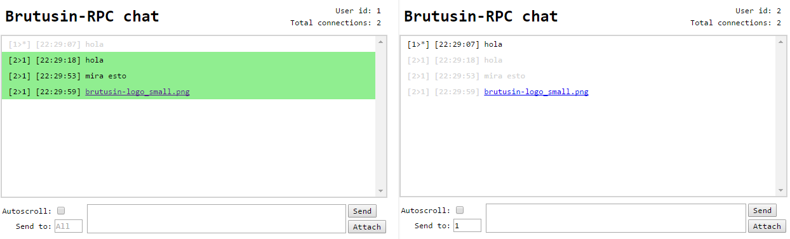
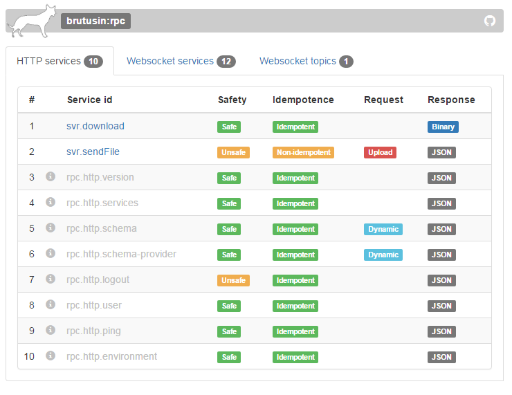
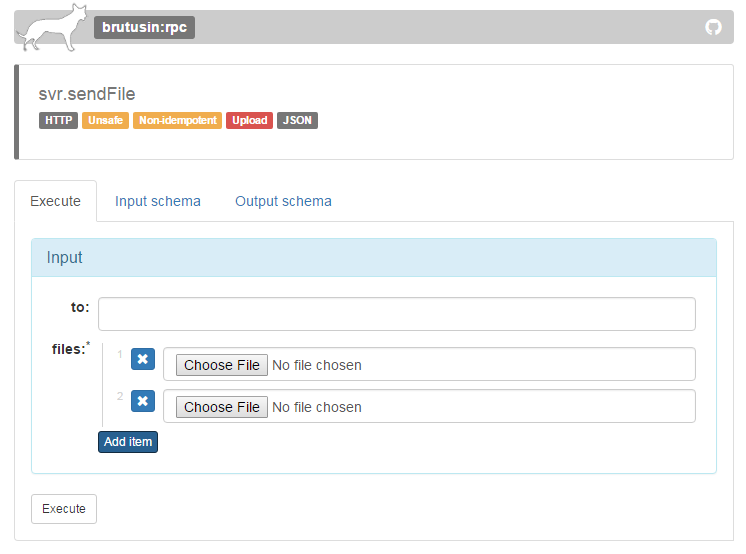
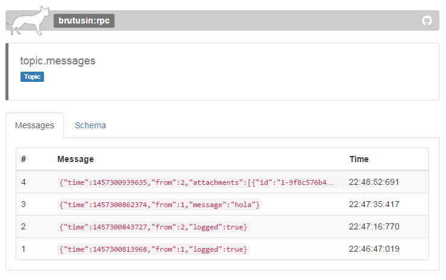

Brutusin-RPC es un nuevo microframework Java orientado a la creación APIs JSON-RPC para ser consumidas en [aplicaciones single-page](https://es.wikipedia.org/wiki/Single-page_application) via AJAX o Websockets.

El framework ha sido diseñado con el objetivos principal de ofrecer una alta mantentenibilidad de los servicios, y como característica diferenciadora, incluye por defecto un repositorio de los servicios disponibles, donde el desarrollador puede ver lo servicios disponibles, sus características y descripciones, e incluso ejecutarlos directamente a través de un formulario generado automáticamente acorde a la estructura del mensaje de entrada del servicio. Al final del tutorial exploraremos esta funcionalidad que permite crear APIs auto descriptivas, y aumenta sustancialmente la mantenibilidad y legibilidad de los servicios.

En este tutorial desarrollaremos una aplicación de chat, en la que se hará uso de los distintos elementos que ofrece el framework:
 - JSON-RPC sobre HTTP
 - JSON-RPC sobre Websockets
 - Publish/subscribe sobre Websockets.

## Descripción general
El chat, será construido como una aplicación de página única. Una jsp (`index.jsp`) recibirá la petición inicial, y devolverá al navegador el código HTML, CSS y Javascript que definirá la presentación. Posteriormente esté codigo cliente desencadenará una sucesión de peticiones AJAX y Websocket a los servicios implementados por con Brutusin-RPC, para obtener los datos.

La aplicación asociará un identificador (entero autoincremental) a cada sesión de usuario, y permitirá el envío de mensajes públicos (visibles por todos los usuarios) como privados (visible sólo por emisor y receptor), así como la subida/bajada de ficheros.



La API a crear será la siguiente:

### Servicios HTTP
Estos servicios serán los consumidos mediante AJAX desde el navegador.

 - `sendFile(to, files)`: Subirá los ficheros al servidor y comunicará a los destinatarios (emisor/receptor o todos) su identificador para descargarlos.
 - `download(id)`: Permita descargar un fichero, conocido su identificador.
 
### Servicios Websocket
Websocket es un protocolo de bajo nivel iniciado desde HTTP pero que posteriormente no incluye ninguna caraterística adicional a TCP/IP. Por ello su uso es recomendable para escenarios que requieran bidireccionalidad (HTTP no lo permite), o una alta frecuencia de intercambio de (pequeños) mensajes, en los que la trama HTTP añadiría un considerable overhead al tamaño de estos.

 - `getCurrentUser()`: Devuelve la información (id de usuario), del propio usuario
 - `getAllUsers()`: Devuelve el listado de usuarios activos
 - `sendMessage(to, message)`: Envía un mensaje a los destinatarios (emisor/receptor o todos) 
 
### Topics
Los "topics" son entidades lógicas que, conceptualmente y de manera genérica, representan "puntos de interés" para sus clientes. Definidos originalmente en el patrón de diseño ["publish/subscribe"](https://en.wikipedia.org/wiki/Publish%E2%80%93subscribe_pattern), en el caso particular de Brutusin-RPC representan canales de comunicación de servidor a cliente.

Utilizando la [API Javascript](https://github.com/brutusin/Brutusin-RPC/wiki/Javascript-API) proporcionada por el framework, el código cliente puede realizar la suscripción al topic y especificar una función callback que será invocada por el framework cada vez que llege un mensaje del servidor. 

Desde el punto de vista del servidor, los topics:
 - Implementan un método de filtrado, que define, dado un filtro, qué subscriptores son destinatarios del mensaje
 - Ofrecen un método para publicar mensajes (utilizado desde los servicios)
 
Esta aplicación de define un único "topic":
 - `messages`: Topic al que se suscriben todos los usuarios y que permite su interacción, via publicación y notificación de mensajes. La aplicación publicará en este topic 3 tipos diferentes de mensajes: 
   - Mensajes de texto
   - Mensajes de subidas de ficheros
   - Login/logout de usuarios
 
## Implementación

### Requisitos
>- JDK 1.7 o posterior
- Maven 3.0+

### Creación del proyecto
El primer paso consiste en crear la estructura del proyecto utilizando el siguiente arquetipo maven:
 [`rpc-tomcat-war`](https://github.com/brutusin/Brutusin-RPC/tree/master/rpc-archetypes/rpc-tomcat-war)

Para ello, en el directorio de tu elección, ejecuta el siguiente comando maven:
```properties
mvn archetype:generate -B -DarchetypeGroupId=org.brutusin -DarchetypeArtifactId=rpc-tomcat-war -DarchetypeVersion=${version} -DgroupId=org.brutusin -DartifactId=rpc-chat -Dversion=1.0.0-SNAPSHOT
```

Siendo:
`${version}` la última versión del arquetipo disponible en Maven Central [](https://maven-badges.herokuapp.com/maven-central/org.brutusin/rpc-tomcat-war/)

y entonces, la siguiente estructura del proyecto será creada:
```
.
|-- rpc-chat
|   |-- src/main
|   |   |-- webapp
|   |   |   |-- index.jsp
|   |   |   |-- WEB-INF
|   |   |   |   |-- web.xml
|   |   |-- resources
|   |   |   |-- brutusin-rpc.xml
|   |   |-- java/org/brutusin/rpc_chat/security
|   |   |   |-- SecurityConfig.java
|   |   |   |-- SecurityInitializer.java
|   |-- pom.xml
```
finalmente, establece la carpeta raiz del proyecto recien creado como directorio de trabajo:

```sh
cd rpc-chat
```

### Identificación del usuario
 
Como se ha comentado, el usuario se identificará mediante un entero asociado a su sesión. 
Crearemos la clase `org.brutusin.rpc_chat.User` para representar a un usuario y dejar lugar a futura funcionalidad (nickname, IP, ...)
 
[**`src/main/java/org/brutusin/rpc_chat/User.java`**](https://raw.githubusercontent.com/brutusin/Brutusin-RPC/master/rpc-demos/rpc-chat/src/main/java/org/brutusin/rpc_chat/User.java):
 
 ```java
 public final class User {

    private static final AtomicInteger counter = new AtomicInteger();
    private final Integer id;

    private User() {
        this.id = counter.incrementAndGet();
    }

    public Integer getId() {
        return id;
    }

    public static User from(HttpSession httpSession) {
        synchronized (httpSession) {
            User user = (User) httpSession.getAttribute(User.class.getName());
            if (user == null) {
                user = new User();
                httpSession.setAttribute(User.class.getName(), user);
            }
            return user;
        }
    }
}
 ```

### Topic

El topic a implementar trabajará con mensajes de tipo `org.brutusin.rpc_chat.topics.Message` y permitirá filtrado por id de usuario (para permitir mensajes privados que sólo lleguen a ese usuario).

#### Mensaje:

Como hemos comentado anteriormente, estos mensajes representarán tres tipos de eventos (mensajes de texto, envio de fichero y login/logout de usuarios). Podría haberse optado por utilizar topics independientes para estos casos, pero por mantener el ejemplo más simple se ha optado por esto.

[**`src/main/java/org/brutusin/rpc_chat/topics/Message.java`**](https://raw.githubusercontent.com/brutusin/Brutusin-RPC/master/rpc-demos/rpc-chat/src/main/java/org/brutusin/rpc_chat/topics/Message.java):

```java
public class Message {

    private long time;
    private Integer from;
    private Integer to;
    private String message;
    private Attachment[] attachments;
    private Boolean logged;

    public long getTime() {
        return time;
    }

    public void setTime(long time) {
        this.time = time;
    }

    public String getMessage() {
        return message;
    }

    public void setMessage(String message) {
        this.message = message;
    }

    public Integer getFrom() {
        return from;
    }

    public void setFrom(Integer from) {
        this.from = from;
    }

    public Integer getTo() {
        return to;
    }

    public void setTo(Integer to) {
        this.to = to;
    }

    public Attachment[] getAttachments() {
        return attachments;
    }

    public void setAttachments(Attachment[] attachments) {
        this.attachments = attachments;
    }

    public Boolean getLogged() {
        return logged;
    }

    public void setLogged(Boolean logged) {
        this.logged = logged;
    }
}
```
representando `Attachment` una referencia a un upload almacenado en el repositorio:

[**`src/main/java/org/brutusin/rpc_chat/topics/Attachment.java`**](https://raw.githubusercontent.com/brutusin/Brutusin-RPC/master/rpc-demos/rpc-chat/src/main/java/org/brutusin/rpc_chat/topics/Attachment.java):

```java
public class Attachment {

    private String id;
    private String name;
    private String contentType;

    public String getId() {
        return id;
    }

    public void setId(String id) {
        this.id = id;
    }

    public String getName() {
        return name;
    }

    public void setName(String name) {
        this.name = name;
    }

    public String getContentType() {
        return contentType;
    }

    public void setContentType(String contentType) {
        this.contentType = contentType;
    }
}
```
#### Implementación:

Para crear un topic se extiende de la clase base del framework `Topic<F,M>`, siendo `F` la clase que representa al filtro, y `M` la de sus mensajes.

Por lo tanto en este caso crearemos la clase `MessageTopic` extendiendo de `Topic<Integer, Message>`:

[**`src/main/java/org/brutusin/rpc_chat/topics/MessageTopic.java`**](https://raw.githubusercontent.com/brutusin/Brutusin-RPC/master/rpc-demos/rpc-chat/src/main/java/org/brutusin/rpc_chat/topics/MessageTopic.java):

```java
public class MessageTopic extends Topic<Integer, Message> {

    private final Map<Integer, WritableSession> sessionMap = Collections.synchronizedMap(new HashMap());

    @Override
    protected void beforeSubscribe(WritableSession session) {
        User user = getUser();
        session.getUserProperties().put("user", user);
        sessionMap.put(user.getId(), session);
        Message message = new Message();
        message.setFrom(user.getId());
        message.setTime(System.currentTimeMillis());
        message.setLogged(true);
        fire(null, message);
    }

    @Override
    protected void afterUnsubscribe(WritableSession session) {
        User user = getUser();
        sessionMap.remove(getUser().getId());
        Message message = new Message();
        message.setFrom(user.getId());
        message.setTime(System.currentTimeMillis());
        message.setLogged(false);
        fire(null, message);
    }

    @Override
    public Set<WritableSession> getSubscribers(Integer filter) {
        if (filter == null) {
            return super.getSubscribers();
        }
        WritableSession toSession = sessionMap.get(filter);
        if (toSession == null) {
            return null;
        }
        HashSet<WritableSession> ret = new HashSet<WritableSession>();
        ret.add(toSession);
        ret.add(sessionMap.get(getUser().getId()));
        return ret;
    }

    private User getUser() {
        return User.from(RpcActionSupport.getInstance().getHttpSession());
    }
    
    public static void main(String[] args) {
        Server.test(new MessageTopic());
    }
}

```
Hay varios puntos a resaltar sobre el anterior código:
- La creación y cancelación de suscripciones estamos creando mensajes (llamadas a `fire(null, message)`) para notificar a todos los suscriptores actuales el evento de login/logout en curso.
- Se almacena el usuario en la sesión Websocket (`session.getUserProperties().put("user", user);`) para poder obtenerlo posteriormente fuera del ámbito de una invocación del propio usuario
- Si el filtro (id del destinatario) es nulo, todos los subscriptores del topic serán destinatarios del mensaje.


### Servicios de usuario

A continuación vamos a implementar los servicios Websocket `getCurrentUser()` y `getAllUsers()` a los que hacíamos referencia previamente. Para ello extendemos de la clase del framework `WebsocketAction<I, O>` siendo 
`I` y `O` los parámetros de los tipos que representan los mensajes de entrada y salida del servicio.

[**`src/main/java/org/brutusin/rpc_chat/actions/GetCurrentUserAction.java`**](https://raw.githubusercontent.com/brutusin/Brutusin-RPC/master/rpc-demos/rpc-chat/src/main/java/org/brutusin/rpc_chat/actions/GetCurrentUserAction.java);
```java
public class GetUserInfoAction extends WebsocketAction<Void, User> {

    @Override
    public User execute(Void input) throws Exception {
       return User.from(WebsocketActionSupport.getInstance().getHttpSession());
    }
}
```

[**`src/main/java/org/brutusin/rpc_chat/actions/GetAllUsersAction.java`**](https://raw.githubusercontent.com/brutusin/Brutusin-RPC/master/rpc-demos/rpc-chat/src/main/java/org/brutusin/rpc_chat/actions/GetAllUsersAction.java)
```java
public class GetUsersAction extends WebsocketAction<Void, User[]> {

    private MessageTopic topic;

    public MessageTopic getTopic() {
        return topic;
    }

    public void setTopic(MessageTopic topic) {
        this.topic = topic;
    }

    @Override
    public User[] execute(Void v) throws Exception {
        Set<WritableSession> subscribers = topic.getSubscribers();
        User[] ret = new User[subscribers.size()];
        synchronized (subscribers) {
            int i = 0;
            for (WritableSession session : subscribers) {
                ret[i++] = (User) session.getUserProperties().get("user");
            }
        }
        return ret;
    }
}
```
A resaltar dos puntos:

1. Cómo hacemos uso de la sesión para recuperar el usuario (almacenado previamente por el topic en el proceso de subcripción).
2. Esta clase tiene como atributo un objeto topic que posteriormente inyectaremos via Spring.

### Envío de mensajes

A continuación codificaremos el servicio que permite al usuario actual publicar mensajes de texto en el topic y, de manera indirecta, enviárselo a todos los usuario conectados o a un único destinatario, dependiendo de si el filtro del topic (id del destinatario) es o no especificado:

[**`src/main/java/org/brutusin/rpc_chat/actions/SendMessageAction.java`**](https://raw.githubusercontent.com/brutusin/Brutusin-RPC/master/rpc-demos/rpc-chat/src/main/java/org/brutusin/rpc_chat/actions/SendMessageAction.java):

```java
public class SendMessageAction extends WebsocketAction<SendMessageAction.SendMessageInput, Boolean> {

    private MessageTopic topic;

    public MessageTopic getTopic() {
        return topic;
    }

    public void setTopic(MessageTopic topic) {
        this.topic = topic;
    }

    @Override
    public Boolean execute(SendMessageInput input) throws Exception {
        if (input == null) {
            throw new IllegalArgumentException("Input is required");
        }
        Integer from = User.from((HttpSession) WebsocketActionSupport.getInstance().getHttpSession()).getId();
        Message message = new Message();
        message.setFrom(from);
        message.setTo(input.getTo());
        message.setMessage(input.getMessage());
        message.setTime(System.currentTimeMillis());
        return topic.fire(input.getTo(), message);
    }

    public static class SendMessageInput {
        private Integer to;
        @JsonProperty(required = true)
        private String message;

        public Integer getTo() {
            return to;
        }

        public void setTo(Integer to) {
            this.to = to;
        }

        public String getMessage() {
            return message;
        }

        public void setMessage(String message) {
            this.message = message;
        }
    }
}
```
Como vemos, el servicio recibe una entrada de tipo `SendMessageInput`, compone un mensaje y lo publica en el topic. 


### Servicios de ficheros

En esta parte final implementaremos los servicios de subida y descarga de ficheros, que permitirán a los usuarios enviar ficheros a otros usuarios de manera pública o privada.

#### Servicio de envío de ficheros

Este servicio será el encargado de realizar el upload de los fichero seleccionados por el usuario, almacenarlos en un directorio temporal bajo un nombre aleatorio (que no permita su descarga a usuarios que desconozcan su id) y finalmente publicará en el topic un mensaje con la información necesaria para que los receptores puedan descargarlo.

La subida de ficheros en Brutusin-RPC se implementa de manera transparente sólo con utilizar propiedades de `MetadataInputStream` en el input servicios HTTP.

El framework proporciona dos clases base para la creación de servicios sobre HTTP: `SafeAction<I,O>` y `UnsafeAction<I,O>` dependiendo de si la operación se considera "segura" desde el punto de vista HTTP.
Como esta operación envía y modifica datos en el servidor, se considera "no segura" y, por lo tanto, utilizaremos la segunda opción:

[**`src/main/java/org/brutusin/rpc_chat/actions/SendFileAction.java`**](https://raw.githubusercontent.com/brutusin/Brutusin-RPC/master/rpc-demos/rpc-chat/src/main/java/org/brutusin/rpc_chat/actions/SendFileAction.java):
```java
public class SendFileAction extends UnsafeAction<SendFileInput, Boolean> {

    public static final File UPLOAD_ROOT = new File(System.getProperty("java.io.tmpdir"), "chat-uploads");
    
    private final AtomicInteger counter = new AtomicInteger();

    private MessageTopic topic;

    public MessageTopic getTopic() {
        return topic;
    }

    public void setTopic(MessageTopic topic) {
        this.topic = topic;
    }

    @Override
    public Boolean execute(SendFileInput input) throws Exception {
        if (input == null) {
            throw new IllegalArgumentException("Input can no be null");
        }
        MetaDataInputStream[] streams = input.getFiles();
        Attachment[] attachments = new Attachment[streams.length];
        HttpServletRequest request = HttpActionSupport.getInstance().getHttpServletRequest();
        Integer uploader = User.from(request.getSession()).getId();
        for (int i = 0; i < streams.length; i++) {
            MetaDataInputStream is = streams[i];
            attachments[i] = saveStream(is);
        }
        Message message = new Message();
        message.setTime(System.currentTimeMillis());
        message.setFrom(uploader);
        message.setTo(input.getTo());
        message.setAttachments(attachments);
        return topic.fire(input.getTo(), message);
    }

    private Attachment saveStream(MetaDataInputStream is) throws IOException {
        if (is == null) {
            throw new IllegalArgumentException("Input stream can no be null");
        }
        String id = counter.getAndIncrement() + "-" + CryptoUtils.getHashMD5(is.getName() + System.currentTimeMillis()) + "/" + is.getName();

        File dataFile = new File(UPLOAD_ROOT, id);
        Miscellaneous.createDirectory(dataFile.getParent());
        File metadataFile = new File(dataFile.getAbsolutePath() + ".info");
        FileOutputStream fos = new FileOutputStream(dataFile);
        Attachment attachment = new Attachment();
        attachment.setId(id);
        attachment.setName(is.getName());
        attachment.setContentType(is.getContentType());
        Miscellaneous.writeStringToFile(metadataFile, JsonCodec.getInstance().transform(attachment), "UTF-8");
        Miscellaneous.pipeSynchronously(is, fos);
        return attachment;

    }

    public static class SendFileInput {

        private Integer to;
        @JsonProperty(required = true)
        private MetaDataInputStream[] files;

        public Integer getTo() {
            return to;
        }

        public void setTo(Integer to) {
            this.to = to;
        }

        public MetaDataInputStream[] getFiles() {
            return files;
        }

        public void setFiles(MetaDataInputStream[] files) {
            this.files = files;
        }
    }
}
```

#### Servicio de descarga de ficheros

Este último servicio es el que permite descargar los ficheros subidos por el servicio anterior, conocido su identificador. 
Los servicios HTTP de Brutusin-RPC permiten la descarga de archivos utilizando como clase del output `StreamResult`. Por lo tanto, dado que la operación de descarga es "segura" desde el punto de vista HTTP:

[**`src/main/java/org/brutusin/rpc_chat/actions/DownloadFileAction.java`**](https://raw.githubusercontent.com/brutusin/Brutusin-RPC/master/rpc-demos/rpc-chat/src/main/java/org/brutusin/rpc_chat/actions/DownloadFileAction.java):
```java
public class DownloadFileAction extends SafeAction<String, StreamResult> {

    @Override
    public Cacheable<StreamResult> execute(String id) throws Exception {
        File f = new File(SendFileAction.UPLOAD_ROOT, id);
        if (!isValid(f)) {
            throw new IllegalArgumentException("Invalid id: " + id);
        }
        File metaFile = new File(SendFileAction.UPLOAD_ROOT, id + ".info");
        Attachment attachment = JsonCodec.getInstance().parse(Miscellaneous.toString(new FileInputStream(metaFile), "UTF-8"), Attachment.class);
        StreamResult ret = new StreamResult(new MetaDataInputStream(new FileInputStream(f), attachment.getName(), attachment.getContentType(), f.length(), f.lastModified()));
        return Cacheable.forMaxHours(ret, 1);
    }

    private static boolean isValid(File f) {
        if (!f.exists()) {
            return false;
        }
        File parent = f.getParentFile();
        while (parent != null) {
            if (parent.equals(SendFileAction.UPLOAD_ROOT)) {
                return true;
            }
            parent = parent.getParentFile();
        }
        return false;
    }
}
```

### Registro de componentes
Ahora reazalizaremos el registro de los componentes en contexto de aplicación de Spring del framework, configurado a través del fichero [`src/main/resources/brutusin-rpc.xml`](https://raw.githubusercontent.com/brutusin/Brutusin-RPC/master/rpc-demos/rpc-chat/src/main/resources/brutusin-rpc.xml):

```xml
<?xml version="1.0" encoding="UTF-8"?>
<beans xmlns="http://www.springframework.org/schema/beans"
       xmlns:xsi="http://www.w3.org/2001/XMLSchema-instance"
       xsi:schemaLocation="http://www.springframework.org/schema/beans 
	   					   http://www.springframework.org/schema/beans/spring-beans.xsd">

    <bean id="topic.messages" class="org.brutusin.rpc_chat.topics.MessageTopic"/> 
    <bean id="svr.getAllUsers" class="org.brutusin.rpc_chat.actions.GetAllUsersAction"> 
        <property name="topic" ref="topic.messages"/>
    </bean>
    <bean id="svr.download" class="org.brutusin.rpc_chat.actions.DownloadFileAction"/>
    <bean id="svr.getCurrentUser" class="org.brutusin.rpc_chat.actions.GetCurrentUserAction"/> 
    <bean id="svr.sendFile" class="org.brutusin.rpc_chat.actions.SendFileAction"> 
        <property name="topic" ref="topic.messages"/>
    </bean>
    <bean id="svr.sendMessage" class="org.brutusin.rpc_chat.actions.SendMessageAction"> 
        <property name="topic" ref="topic.messages"/>
    </bean>
</beans>
```

### Aplicación cliente
Para crear la aplicación cliente del chat, utilizaremos HTML y Javascript sin ningún framework adicional, editando el fichero [src/main/webapp/index.jsp](https://raw.githubusercontent.com/brutusin/Brutusin-RPC/master/rpc-demos/rpc-chat/src/main/webapp/index.jsp):

 - Fuera del ambito del framework
 - CSRF token
 - API javascript
 - Drag and drop
 
```html
<!DOCTYPE html>
<html>
    <head>
        <meta name=viewport content='width=500'>
        <meta name="_csrf" content="${_csrf.token}"/>
        <meta name="_csrf_header" content="${_csrf.headerName}"/>
        <meta charset="utf-8">
        <title>Brutusin-RPC chat</title>
        <script src="rpc/brutusin-rpc.js"></script>
        <script language='javascript'>
            var http = brutusin["rpc"].initHttpEndpoint("<%=request.getContextPath() + org.brutusin.rpc.RpcConfig.getInstance().getPath() + "/http"%>");
            var wsk = brutusin["rpc"].initWebsocketEndpoint("<%=request.getContextPath() + org.brutusin.rpc.RpcConfig.getInstance().getPath() + "/wskt"%>");
            var totalConnections;
            var userId;
            var autoscroll;
            var inputTo;
            var inputText;
            wsk.subscribe("topic.messages", onMessage);
            wsk.exec({
                service: "svr.getCurrentUser",
                load: function (response) {
                    userId = response.result.id;
                    document.getElementById("userId").innerHTML = userId;
                }});
            wsk.exec({
                service: "svr.getAllUsers",
                load: function (response) {
                    setTotalUsers(response.result.length);
                }});
            function setTotalUsers(n) {
                totalConnections = n;
                document.getElementById("total").innerHTML = totalConnections;
            }
            function onMessage(message) {
                if (message.hasOwnProperty("logged")) {
                    if (message.logged) {
                        setTotalUsers(totalConnections + 1);
                    } else {
                        setTotalUsers(totalConnections - 1);
                    }
                } else {
                    if (message.message) {
                        renderMessage(message);
                    } else if (message.attachments) {
                        renderFile(message);
                    }
                    scroll();
                }
            }

            function scroll() {
                if (autoscroll.checked) {
                    var main = document.getElementById("main");
                    main.scrollTop = main.scrollHeight;
                }
            }

            function getDate(milis) {
                var date;
                if (milis) {
                    date = new Date(milis);
                } else {
                    date = new Date();
                }
                function pad(num, size) {
                    var s = "00" + num;
                    return s.substr(s.length - size);
                }
                return pad(date.getHours(), 2) + ":" + pad(date.getMinutes(), 2) + ":" + pad(date.getSeconds(), 2);
            }


            function renderFile(message) {
                var msg = "[" + message.from + ">" + (message.to ? message.to : "*") + "] [" + getDate(message.time) + "]";
                var ul = document.getElementById("messages");
                var li = document.createElement("li");
                li.className += " file";
                if (message.from === userId) {
                    li.className += " from";
                } else
                if (message.to === userId) {
                    li.className += " to";
                }
                ul.appendChild(li);
                var span = document.createElement("span");
                var txtNode = document.createTextNode(msg);
                span.appendChild(txtNode);
                li.appendChild(span);

                for (var i = 0; i < message.attachments.length; i++) {
                    var a = document.createElement("a");
                    a.href = "#";
                    (function () {
                        var id = message.attachments[i].id;
                        a.onclick = function () {
                            downloadFile(id);
                        }
                    }());
                    var txtNode = document.createTextNode(message.attachments[i].name);
                    a.appendChild(txtNode);
                    li.appendChild(a);
                }
            }

            function renderMessage(message) {
                var msg = "[" + message.from + ">" + (message.to ? message.to : "*") + "] [" + getDate(message.time) + "] " + (message.message ? message.message : "");
                var ul = document.getElementById("messages");
                var li = document.createElement("li");
                if (message.from === userId) {
                    li.className += " from";
                } else
                if (message.to === userId) {
                    li.className += " to";
                }
                li.onclick = function () {
                    inputTo.value = message.from;
                    inputText.focus();
                };
                li.style.cursor = "pointer";
                var txtNode = document.createTextNode(msg);
                li.appendChild(txtNode);
                ul.appendChild(li);
            }

            function renderError(to, error) {
                var ul = document.getElementById("messages");
                var li = document.createElement("li");
                li.className += " error";
                var txtNode = document.createTextNode("[" + userId + ">" + (to ? to : "*") + "] [" + getDate() + "] [" + error + "]");
                li.appendChild(txtNode);
                ul.appendChild(li);
            }

            function renderProgress(to) {
                var ul = document.getElementById("messages");
                var li = document.createElement("li");
                li.className += "from";
                li.appendChild(document.createTextNode("[" + userId + ">" + (to ? to : "*") + "] [" + getDate() + "] "));
                var txtNode = document.createTextNode("");
                li.appendChild(txtNode);
                ul.appendChild(li);
                scroll();
                return txtNode;
            }

            function sendFiles(files) {
                if (files.length > 0) {
                    var input = getInput(files);
                    if (inputTo.value) {
                        input.data.to = parseInt(inputTo.value);
                    }
                    var progressNode = renderProgress(input.data.to);
                    var current = 0;
                    http.ajax({service: "svr.sendFile",
                        files: input.fileMap,
                        input: input.data,
                        load: function (response, status, message) {
                            if (response) {
                                if (response.error) {
                                    progressNode.nodeValue = " [" + response.error.meaning + (response.error.data ? (". " + response.error.data) : "") + "]";
                                    progressNode.parentNode.className += " error";
                                    scroll();
                                } else if (!response.result) {
                                    progressNode.nodeValue = " [Files could not be delivered]";
                                    progressNode.parentNode.className += " error";
                                    scroll();
                                } else {
                                    progressNode.parentNode.parentNode.removeChild(progressNode.parentNode);
                                }
                            } else {
                                progressNode.nodeValue = " [HTTP " + status + " (" + message + ")]";
                                progressNode.parentNode.className += " error";
                                scroll();
                            }
                        },
                        progress: function (evt) {
                            var num = Math.round(50 * evt.loaded / evt.total);
                            if (num > current) {
                                var str = "";
                                for (var i = 1; i <= num; i++) {
                                    str += "*";
                                }
                                for (var i = num + 1; i <= 50; i++) {
                                    str += ".";
                                }
                                current = num;
                                progressNode.nodeValue = str;
                            }
                        }});
                }
            }

            function sendMessage() {

                if (inputText.value) {
                    var input = {};
                    if (inputTo.value) {
                        input.to = parseInt(inputTo.value);
                    }
                    input.message = inputText.value;
                    wsk.exec({
                        service: "svr.sendMessage",
                        input: input,
                        load: function (response) {
                            if (response.error) {
                                renderError(input.to, response.error.meaning + (response.error.data ? (". " + response.error.data) : ""));
                                scroll();
                            } else if (!response.result) {
                                renderError(input.to, "Message could not be delivered '" + input.message + "'");
                                scroll();
                            }
                        }});
                    inputText.value = "";
                }
            }

            function allowDrop(ev) {
                ev.preventDefault();
            }


            function getInput(files) {
                var input = {};
                input.data = {};
                input.data.files = [];
                input.fileMap = {};
                for (var i = 0; i < files.length; i++) {
                    var key = i + "";
                    input.data.files[i] = key;
                    input.fileMap[key] = files[i];
                }
                return input;
            }

            function drop(ev) {
                ev.preventDefault();
                sendFiles(ev.dataTransfer.files);

            }

            function downloadFile(id) {
                http.ajax({service: "svr.download",
                    input: id});
            }
        </script>
        <style>
            body, input, button{font-family: monospace}
            #messages {list-style-type: none; margin: 0; padding: 0}
            #messages li { padding: 5px 10px;}
            #messages li.from { color: lightgray;} 
            #messages li.to { background-color: lightgreen} 
            #messages li.error { color: red} 
            #messages li a {margin-right: 7px; margin-left: 7px} 
            .wrapperVertical {
                height: 100vh;
                display: -webkit-box;
                display: -webkit-flex;
                display: -ms-flexbox;
                display: flex;
                -webkit-box-orient: vertical;
                -webkit-box-direction: normal;
                -webkit-flex-direction: column;
                -ms-flex-direction: column;
                flex-direction: column;
            }
            .flex {
                -webkit-box-flex: 1;
                -webkit-flex: 1;
                -ms-flex: 1;
                flex: 1;
                overflow-y: scroll;
            }
            main {
                border: lightgray solid 2px;
                margin: 4px;
            }
            header {
                height: 40px;
                margin: 8px;
            }
            footer {
                height: 70px;
            }
            body {
                margin: 0;
            }

        </style></head><body>
        <div class="wrapperVertical">
            <header>
                <table style="width:100%">
                    <tr>
                        <td style="text-align: left; width: 100%; font-size: 200%; font-weight: bold">Brutusin-RPC chat</td>
                        <td style="text-align: right">
                            <table>
                                <tr>
                                    <td style="text-align: right; white-space: nowrap">User id: <span id="userId"></span></td>
                                </tr>
                                <tr>    
                                    <td style="text-align: right; white-space: nowrap">Total connections:  <span id="total"></span></td>
                                </tr>
                            </table>
                        </td>
                    </tr>
                </table>
            </header>
            <main id="main" class="flex" ondrop="drop(event)" ondragover="allowDrop(event)">
                <ul id="messages"></ul>
            </main>
            <footer>
                <table style="width:100%">
                    <tr>
                        <td>
                            <table >
                                <tr>
                                    <td style="text-align: right"> Autoscroll:</td>
                                    <td><input id="autoscroll" type="checkbox" onclick="scroll()"/></td>
                                </tr>
                                <tr>
                                    <td  style="text-align: right">Send to:</td>
                                    <td><input type="number" id="inputTo" placeholder="All" style="width: 40px"/></td>
                                </tr>
                            </table>
                        </td>
                        <td style="width:100%">
                            <input id="message" style="height:40px;width:100%" type="text" onkeydown = "if (event.keyCode == 13)
                                        sendMessage()"/>
                        </td>
                        <td style="width:50px">
                            <table >
                                <tr>
                                    <td><button onclick="sendMessage()">Send</button></td>
                                </tr>
                                <tr>
                                    <td><button onclick="document.getElementById('inputFile').click()">Attach</button><input id="inputFile" multiple="true" type="file" style="position: fixed; top: -100em" onchange="sendFiles(this.files)"></td>
                                </tr>
                            </table>
                        </td>
                    </tr>
                </table>
            </footer>
        </div>
        <script>
            autoscroll = document.getElementById("autoscroll");
            inputTo = document.getElementById("inputTo");
            inputText = document.getElementById("message");
            inputText.focus();
        </script>
    </body>
</html>
```


## Construcción

Pasaremos ahora a realizar la compilación y empaquetado de la aplicación. Para ello desde el directorio raiz de la aplicación ejecutaremos:

```properties
mvn clean package
```

## Ejecución

- Runtimes integrados

```properties
mvn exec:java -Dexec.mainClass=org.brutusin.rpc.Main
```

## Repositorio de servicios







- Mantenimiento de los servicios

## Proyecto completo

https://github.com/brutusin/Brutusin-RPC/tree/master/rpc-demos/rpc-chat

## Siguientes pasos


