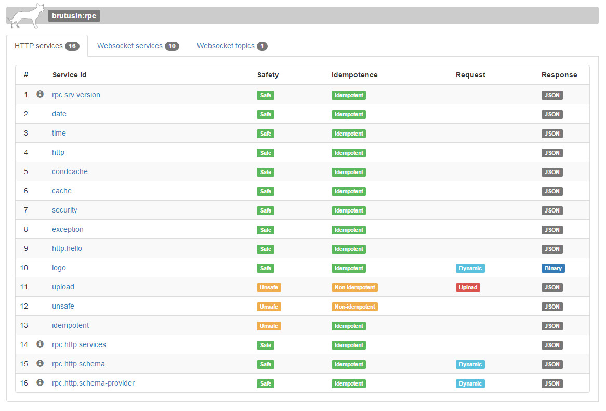

# `org.brutusin:rpc-repo` [](http://www.apache.org/licenses/LICENSE-2.0) [](https://travis-ci.org/brutusin/Brutusin-RPC) [](https://maven-badges.herokuapp.com/maven-central/org.brutusin/rpc-repo/)

Builtin functional testing module for Brutusin-RPC.  

##Usage
This utility is accessed under the following path:
```
http://{$host}:{$port}/{$app}/rpc/repo/
```

[](http://demo.rpc.brutusin.org)

##Live demo

http://demo.rpc.brutusin.org

##Main stack
This module could not be possible without:
* [Bootstrap](http://getbootstrap.com/)
* [JQuery](http://jquery.com/)
* [org.brutusin:json-forms](https://github.com/brutusin/json-forms)

## Support, bugs and requests
https://github.com/brutusin/Brutusin-RPC/issues

## Authors

- Ignacio del Valle Alles (<https://github.com/idelvall/>)

Contributions are always welcome and greatly appreciated!

##License
Apache License, Version 2.0
http://www.apache.org/licenses/LICENSE-2.0
